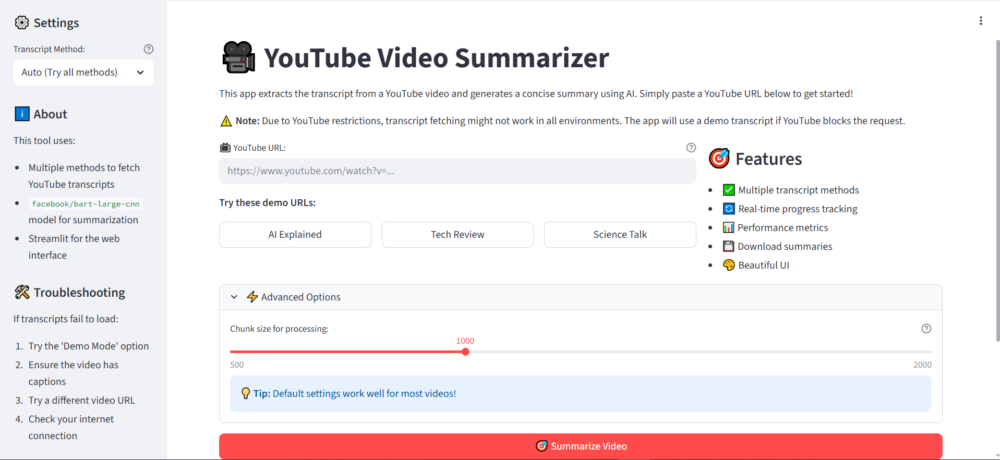

# 🎥 YouTube Video Summarizer

<p align="center">
  
</p>

A powerful web application that automatically extracts transcripts from YouTube videos and generates concise AI-powered summaries using state-of-the-art natural language processing.


[](https://drive.google.com/file/d/1vt0617Af4sKZ5iJmSAcWA-YzwNfcZaC4/view?usp=drive_link)


## 🚀 Overview

The YouTube Video Summarizer is an intelligent tool that leverages AI to process YouTube video content and deliver comprehensive summaries. Built with Streamlit and powered by Facebook's BART-large-CNN model, it provides real-time progress tracking, detailed analytics, and an intuitive user interface.

## ✨ Features

### 🔥 Core Functionality
- **📺 YouTube Integration**: Seamlessly extract transcripts from any public YouTube video
- **🤖 AI-Powered Summarization**: Utilizes state-of-the-art BART model for high-quality summaries
- **📊 Real-time Progress Tracking**: Live progress bars and performance metrics
- **⚡ Dual Processing Modes**: Choose between detailed or simple progress display

### 🎯 User Experience
- **📱 Responsive Design**: Clean, modern interface optimized for all devices
- **🔍 Real-time Metrics**: Live timing, processing speed, and progress indicators
- **📈 Performance Analytics**: Compression ratios and processing statistics
- **💾 Export Capabilities**: Download summaries as text files
- **🎨 Interactive Previews**: Expandable chunk previews for transparency

### ⚙️ Advanced Features
- **🔧 Configurable Processing**: Adjustable chunk sizes for optimal performance
- **📋 Example URLs**: Built-in testing examples
- **🛠️ Error Handling**: Comprehensive error messages and troubleshooting guides
- **🌐 Public Deployment**: Ready for ngrok deployment and sharing

## 🛠️ Installation

### Prerequisites
- Python 3.8+
- pip package manager
- Internet connection

### Step-by-Step Setup

1. **Clone or Download the Project**
   ```bash
   # If using git
   git clone <repository-url>
   cd youtube-summarizer
   ```  

2. **Install Dependencies**
   ```bash    
    pip install transformers==4.52.4
    pip install youtube-transcript-api
    pip install torch
    pip install streamlit
    pip install pyngrok
    pip install nest-asyncio
   ```

3. **Run the Application**
   ```bash
    streamlit run app.py
   ```
## 🎮 Usage

### Basic Usage

1. **Paste YouTube URL**  
   Enter any YouTube video URL in the input field.

2. **Configure Settings** *(optional)*  
   Adjust chunk size in the advanced options if needed.

3. **Start Processing**  
   Click the **"Summarize Video"** button.

4. **Monitor Progress**  
   Watch real-time processing with detailed metrics.

5. **View Results**  
   Read the generated summary and download it if needed.


### Example URLs for Testing

- https://www.youtube.com/watch?v=vBePahzcXfc  
- https://www.youtube.com/watch?v=dQw4w9WgXcQ

---

## 🏗️ Architecture

### Technology Stack

- **Frontend:** Streamlit  
- **AI Model:** Facebook BART-large-CNN (via Hugging Face Transformers)  
- **Video Processing:** YouTube Transcript API  
- **Deployment:** Ngrok for public tunneling  
- **Backend:** Python 3.11, PyTorch  


## Key Components

1. **Transcript Extraction**
 ```python
def get_transcript(video_id: str) -> str:
    # Fetches English transcripts from YouTube
```
2. AI Summarization
```python
def summarize_text_with_progress(text: str, max_chunk: int = 1000) -> str:
    # Processes text in chunks with real-time progress tracking
 ```
3.Progress Tracking
- **Step-by-step processing visualization:** 
- **Real-time performance metrics**
- **Chunk-by-chunk preview system**
---
## 📊 Performance

       Processing Capabilities

- **Average Processing Time: 30-60 seconds**
- **Maximum Video Length: ~60 minutes**
- **Compression Ratio: Typically 70-90%**
- **Chunk Processing: Configurable (500-2000 characters)**

---

## System Requirements

- **RAM: Minimum 4GB, Recommended 8GB+**
- **Storage: 2GB free space for models**
- **GPU: Optional but recommended for faster processing**

---

## 🌐 Deployment

### Local Deployment

```
streamlit run app.py
```

### Public Deployment with Ngrok

```from pyngrok import ngrok
public_url = ngrok.connect(8501)
```
### Cloud Deployment Options

- **Heroku: Suitable for small-scale deployment**
- **AWS/GCP: For production workloads**
- **Streamlit Cloud: Native hosting solution**
---

## 🔧 Configuration
Environment Variables

```python
# Optional: Ngrok authentication for persistent URLs
NGROK_AUTH_TOKEN = "your_ngrok_token_here"
```

---
## Advanced Settings
- **Chunk Size: Balance between context and memory usage**
- **Progress Style: Choose between detailed or simple interfaces**
- **Model Parameters: Adjust summary length and quality**
---
# 🐛 Troubleshooting
### Common Issues

### 1.Transcript Fetching Failed
- **Ensure video has English captions**
- **Verify URL is correct and video is public**
- **Check internet connection**

### 2.Slow Processing
- **Reduce chunk size in advanced options**
- **Ensure adequate system resources**
- **Use GPU acceleration if available**

### 3.Memory Issues
- **Decrease maximum chunk size**
- **Close other memory-intensive applications**
- **Consider cloud deployment for larger videos**

---
### Error Messages

- `"No video id found"`: Invalid YouTube URL format  
- `"Error fetching transcript"`: Video may not have available captions  
- `"CUDA out of memory"`: Reduce chunk size or use CPU  

---

## 🤝 Contributing

We welcome contributions! Please feel free to submit pull requests or open issues for:

- 🐛 Bug fixes  
- ✨ New features  
- 📚 Documentation improvements  
- 🎨 UI/UX enhancements  

### Development Setup

1. Fork the repository  
2. Create a feature branch  
3. Make your changes  
4. Test thoroughly  
5. Submit a pull request  

---

## 🙏 Acknowledgments

- Hugging Face for the Transformers library and BART model  
- Streamlit for the amazing web framework  
- YouTube Transcript API team for transcript extraction  
- Ngrok for seamless tunneling and deployment  

---

## 📞 Support

If you encounter any issues or have questions:

- Check the troubleshooting section above  
- Review the error messages in the application  
- Ensure all dependencies are properly installed  
- Verify YouTube video accessibility  

Made with ❤️ using Streamlit & Transformers
